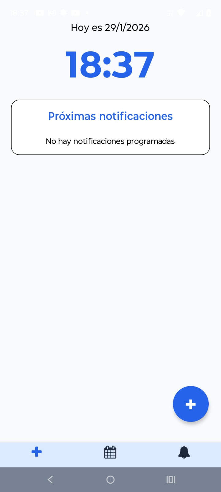
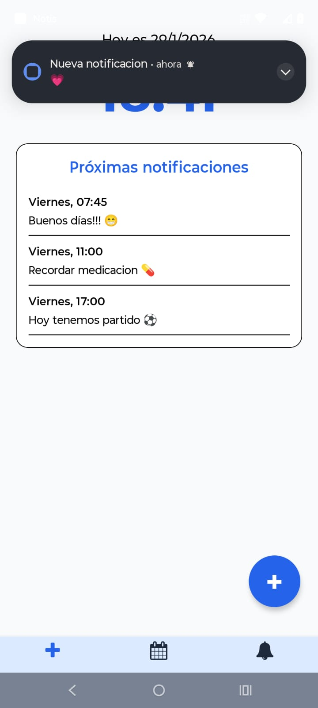
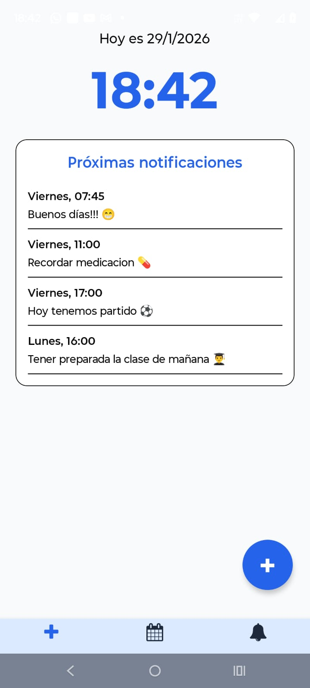
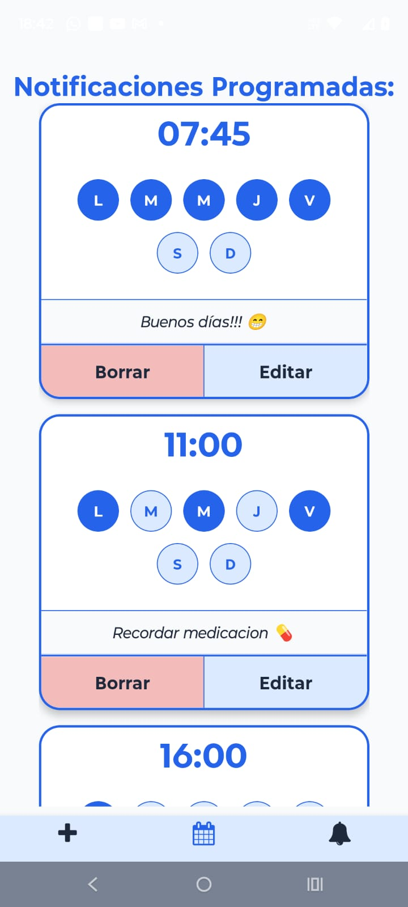
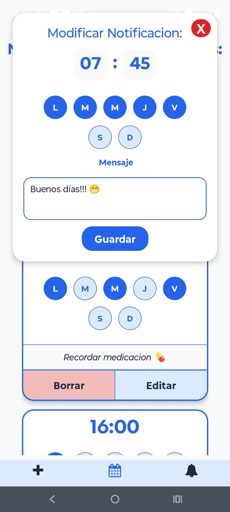
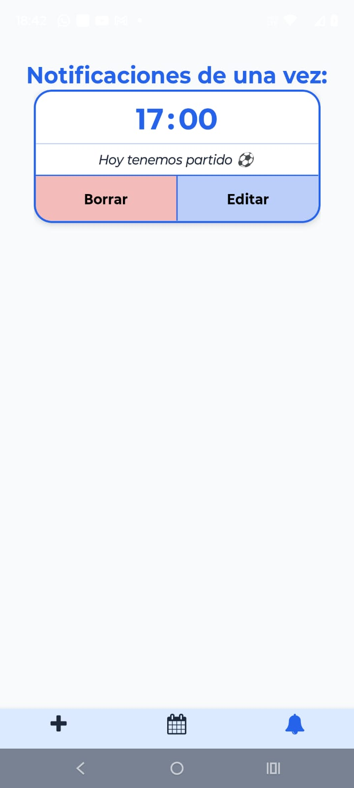
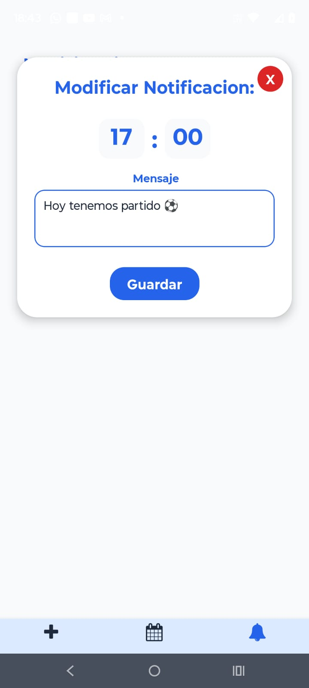

# 🔔📩 Notis

**Aplicación de notificaciones locales desarrollada con React Native y Expo (Bare Workflow / Dev Client).**


---

## 🚀 Descripción

**Notis** es una aplicación de notificaciones simples, claras y personalizables.
Permite programar notificaciones únicas indicando hora y minutos específicos, y recibirlas correctamente incluso cuando la aplicación se encuentra en segundo plano o cerrada.

Está pensada para usuarios que necesitan recordatorios puntuales, sin complejidad innecesaria y con una experiencia visual cuidada.

---

## 🧩 Características principales

- ✉️ **Creación y programación de notificaciones personalizadas**
- ✏️ **Edición y eliminación de notificaciones existentes**
- 🔔 **Notificaciones funcionales en segundo plano**
- ⚙️ **Gestión global del estado con NotificacionContext**
- 🎨 **Interfaz visual personalizada**
- 🧱 **Modal interactivo con validaciones**
- 📱 **Soporte para Android (EAS Build)**

---

> ⚠️ Este proyecto utiliza Expo en modo **Expo (Bare Workflow / Dev Client)**  
> por lo que **no puede ejecutarse con Expo Go**.

---

## 🛠️ Tecnologías utilizadas

- **React Native** (aplicación móvil multiplataforma)
- **Expo (Bare / Dev Client)**  
  Proyecto eyectado de Expo Go para acceso a APIs nativas.
- **Expo Notifications**  
  Programación y gestión de notificaciones locales.
- **Expo Task Manager & Background Fetch**  
  Manejo de tareas en segundo plano.
- **Expo AV / Expo Audio**  
  Reproducción de sonidos para notificaciones.
- **React Navigation**  
  Navegación por tabs y stacks.
- **Context API**  
  Manejo de estado global de notificaciones.
- **AsyncStorage**  
  Persistencia local de notificaciones.
- **EAS Build**  
  Generación de builds nativos para Android.

---

## ⚙️ Dependencias principales

```json
"dependencies": {
  "@react-native-async-storage/async-storage": "2.2.0",
  "@react-navigation/bottom-tabs": "^7.4.7",
  "@react-navigation/native": "^7.1.17",
  "@react-navigation/native-stack": "^7.3.26",
  "expo": "~54.0.30",
  "expo-audio": "~1.1.1",
  "expo-av": "~16.0.8",
  "expo-background-fetch": "~14.0.9",
  "expo-notifications": "~0.32.16",
  "expo-status-bar": "~3.0.9",
  "expo-task-manager": "~14.0.9",
  "react": "19.1.0",
  "react-native": "0.81.5",
  "react-native-safe-area-context": "~5.6.0",
  "react-native-screens": "~4.16.0"
}

```

---

## 🧰 Instalación y ejecución

```bash
git clone https://github.com/IvanGabriel1/notis.git
cd notis
npm install
```

▶️ Ejecutar en desarrollo (Android)

⚠️ Este proyecto utiliza Expo con prebuild (ejectado) y NO funciona con Expo Go.

##### Opción 1:

Android físico:
Conectar un dispositivo Android con Depuración USB activada

- Verificar conexión:

```bash
adb devices
```

- Ejecutar:

```bash
npx expo run:android
```

##### Opción 2:

Android físico
Dev Client instalado en el celular.

Verificar conexión:

```bash
npx expo start --dev-client
```

## 📦 Build con EAS

#### 🔑 Login en EAS

```bash
eas login
```

#### ⚙️ Prebuild (solo una vez)

```bash
npx expo prebuild
```

#### 🧱 Crear build para Android

```bash
eas build -p android
```

###### ⚠️ En Windows no es posible ejecutar builds locales (--local), el build se realiza en los servidores de Expo.

#### 📲 Una vez completado

- **Descargá el .apk o .aab generado desde tu panel en https://expo.dev/accounts**

---

## 📸 Capturas de pantalla

<p >
  
  
  
   
    
    
    
 
</p>
---

## 👨‍💻 Autor

#### Iván Braun

##### ✉️ ivangabraun@gmail.com

---

#### ❤️ Proyecto personal desarrollado con pasión y dedicación, con el objetivo de mejorar mi experiencia en React Native.
